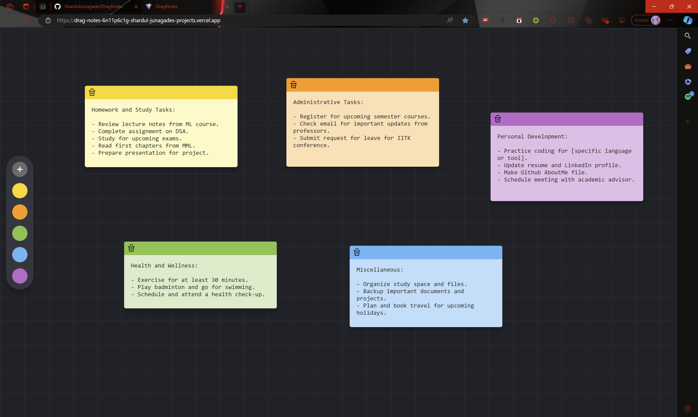

# DragNotes

DragNotes is a dynamic and intuitive React-based note-taking application. With DragNotes, users  can easily create, organize, and customize their notes. 

Built with Vite for rapid development and Appwrite for scalable backend services, DragNotes offers a robust and efficient note-taking experience.




## Table of Contents

- [Tech Stack](#tech-stack)
- [Features](#features)
- [Installation](#installation)
- [Development](#development)
- [Build](#build)
- [Usage](#usage)
- [Contributing](#contributing)
- [License](#license)


## Tech Stack

- **React:** For building a responsive and interactive user interface.
- **Vite:** For a fast and efficient development environment.
- **Appwrite:** For handling backend operations, including data storage and user management.


## Features

- **Create Notes Effortlessly:** Add new notes with a single click.
- **Drag and Drop Functionality:** Reposition your notes with a simple drag-and-drop interface, allowing you to organize your workspace exactly as you want it.
- **Auto-Save Capability:** Your notes' content and positions are automatically saved, ensuring you never lose your work.
- **Customizable Colors:** Change the colors of your notes to match your preferences or for better organization.


## Installation

1. Clone the repository:
	```sh
	git clone https://github.com/ShardulJunagade/DragNotes.git
	cd DragNotes
	```

2. Install dependencies:
	```sh
	npm install
	```

3. Create a `.env` file in the root directory and add your Appwrite credentials:
	```env
	VITE_ENDPOINT=<your-appwrite-endpoint>
	VITE_PROJECT_ID=<your-appwrite-project-id>
	VITE_DATABASE_ID=<your-appwrite-database-id>
	VITE_COLLECTION_NOTES_ID=<your-appwrite-collection-notes-id>
	```

## Development

To start the development server, run:
```sh
npm run dev
```


## Build
To build the project for production, run:
```sh
npm run build
```


## Usage
- Click the Plus (+) to create a new note.
- Drag the note by clicking and holding the header.
- The note's position and content are saved automatically.
- Click on a note to select it and change color.


## Contributing

Contributions are welcome! Please fork the repository and submit a pull request.


## License
This project is licensed under the MIT License.